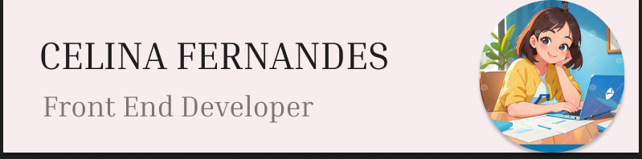

<!-- ### Hi there 👋, I'm Celina Fernandes

- 🔭 I’m currently working on my skills
- 🌱 I have completed Diploma in Web Page Designing & Development Program (DWDP)
- 📫 How to reach me: celina.922.fernz@gmail.com
- 🧑‍💻 Know about my experience [https://drive.google.com/file/d/17-pMan2RCyfg3bPgzMiB6lhwGeQCZI2R/view?usp=drive_link]
- 📑 Know about my certificate [https://drive.google.com/file/d/17LyU3hXdd9XLrCcdcdMt3ITHfiLA3Ggd/view?usp=drive_link] -->

  <h1 align="center">Hi 👋, I'm Celina Fernandes</h1>
<h3 align="center">A passionate frontend developer from India</h3>

- 🌱I have completed Diploma in **Web Page Designing & Development Program (DWDP)**

- 🔭I’m currently **working on my skills**

- 📫 How to reach me **celina.922.fernz@gmail.com**

- 📄 Know about my experiences [https://drive.google.com/file/d/17-pMan2RCyfg3bPgzMiB6lhwGeQCZI2R/view?usp=drive_link](https://drive.google.com/file/d/17-pMan2RCyfg3bPgzMiB6lhwGeQCZI2R/view?usp=drive_link)

<h3 align="left">Connect with me:</h3>

<h3 align="left">Languages and Tools:</h3>

        

